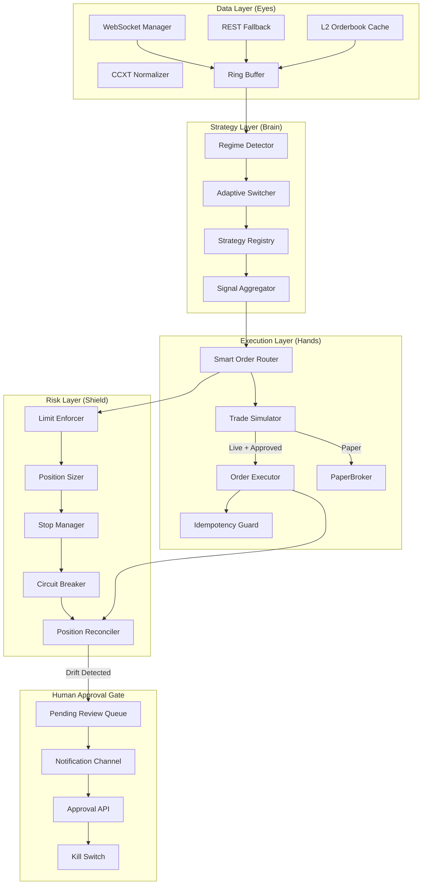

# Jarvis/LifeOS Comprehensive Audit Report

**Auditor**: Principal Quant Engineer + Systems Architect + Security Engineer
**Date**: 2026-01-03
**Scope**: Full system audit with trading focus

---

## 1. Executive Summary

Jarvis is a sophisticated autonomous AI system (~27,000 lines Python, 117 core modules) with voice control, computer automation, trading pipeline, and self-improvement capabilities. The system has **strong existing documentation** and **well-designed modular architecture**, but requires targeted improvements for production trading.

### Key Findings

| Area | Status | Priority Issues |
|------|--------|-----------------|
| **Architecture** | ✅ Well-documented | Minor: circular logic detection passive |
| **Trading Strategies** | ✅ Good coverage | Gap: No walk-forward validation |
| **Data Ingestion** | ✅ Recently added | Gap: No L2 orderbook depth |
| **Risk Management** | ✅ Strong foundation | Enhancement: Add correlation limits |
| **Security** | ⚠️ Partial coverage | P0: Secrets not encrypted at rest |
| **Backtesting** | ⚠️ Basic | P1: Missing slippage models |
| **Self-Improvement** | ✅ Comprehensive | Enhancement: Add DSPy integration |

### Recommendation Summary
1. **Do NOT redo**: Architecture docs, strategy implementations, basic risk controls
2. **Enhance**: Backtesting realism, security hardening, self-improvement metrics
3. **Add**: Walk-forward validation, DSPy-based optimization, approval gates for live

---

## 2. Repo Map + Existing Work Inventory

### 2.1 Functional Boundaries

```mermaid
graph TB
    subgraph UI["User Interface Layer"]
        CLI[bin/lifeos + core/cli.py]
        Voice[core/voice.py]
        Hotkey[core/hotkeys.py]
        Web[web/task_web.py]
    end

    subgraph Daemon["Daemon/Orchestration"]
        D[core/daemon.py]
        MCP[core/mcp_loader.py]
    end

    subgraph Trading["Trading Pipeline"]
        Scanner[core/solana_scanner.py]
        Strategies[core/trading_strategies.py + trading_strategies_advanced.py]
        Pipeline[core/trading_pipeline.py]
        Coliseum[core/trading_coliseum.py]
        Risk[core/risk_manager.py]
        Jito[core/jito_executor.py]
        Data[core/data_ingestion.py]
        ML[core/ml_regime_detector.py]
    end

    subgraph Providers["LLM Providers"]
        Router[core/life_os_router.py]
        Providers[core/providers.py]
    end

    subgraph Memory["Memory/Context"]
        Mem[core/memory.py]
        Ctx[core/context_manager.py]
        Semantic[core/semantic_memory.py]
    end

    subgraph Autonomous["Self-Improvement"]
        Improve[core/self_improvement_engine.py]
        Improve2[core/self_improvement_engine_v2.py]
        Circular[core/circular_logic.py]
        Error[core/error_recovery.py]
    end

    subgraph Security["Security"]
        Guardian[core/guardian.py]
        SecretH[core/secret_hygiene.py]
        SecHard[core/security_hardening.py]
    end

    UI --> Daemon
    Daemon --> Trading
    Daemon --> Providers
    Trading --> Risk
    Trading --> Data
    Providers --> Memory
    Autonomous --> Security
```

### 2.2 Existing Documentation Inventory

| Document | Lines | Coverage | Last Updated |
|----------|-------|----------|--------------|
| ARCHITECTURE.md | 391 | Component map, request flow, state files | 2024-12-30 |
| AUDIT_REPORT.md | 365 | MCP status, control loops, P0-P2 issues | 2025-12-30 |
| TOP_ISSUES.md | 416 | 16 prioritized issues (P0-1 to P2-6) | Current |
| IMPROVEMENTS.md | 161 | Completed vs planned improvements | 2024-12-24 |
| SELF_IMPROVEMENT.md | 485 | Autopatch engine, ticket lifecycle | 2025-12-30 |
| SECURITY_MANUAL.md | 45 | IDS features, alert legend | Current |
| docs/QUANT_TRADING_GUIDE.md | ~300 | Strategy categories, risk assessment | 2026-01-03 |
| COMPREHENSIVE_STRATEGY_LIST.md | 117 | Strategy types from Moon Dev | Current |

### 2.3 What Already Exists (DO NOT REDO)

#### ✅ Trading Strategies Implemented
- **TrendFollower**: MA crossover (short/long period, EMA option)
- **MeanReversion**: Bollinger Bands + RSI
- **DCABot**: Dollar-cost averaging with smart DCA
- **ArbitrageScanner**: Cross-DEX spatial arbitrage
- **SentimentAnalyzer**: Placeholder for NLP signals
- **StrategyEnsemble**: Weighted voting combination
- **TriangularArbitrage**: Cross-rate exploitation (new)
- **GridTrader**: Range-bound strategy (new)
- **BreakoutTrader**: S/R detection (new)
- **MarketMaker**: Bid-ask spread capture (new)

#### ✅ Risk Management Implemented
- **RiskLimits**: Configurable position/drawdown/trade limits
- **PositionSizer**: Kelly-inspired position sizing
- **RiskManager**: Circuit breaker, trade journaling, stop/take-profit
- **SlippageChecker**: Order rejection on tolerance breach (new)

#### ✅ Data Ingestion Implemented
- **WebSocket handlers**: Binance, Kraken (new)
- **CCXT Normalizer**: Multi-exchange (new)
- **TickBuffer**: Ring buffer for tick data (new)
- **Hyperliquid integration**: Perp data, funding rates

#### ✅ Self-Improvement Implemented
- Ticket generation from exceptions/performance/feedback
- Autopatch engine with branch management
- Quality gates: MCP doctor, secret scan, loop metrics
- Risk-level gating (1-10 scale)

#### ✅ Security Implemented
- **SecureKeyManager**: Fernet encryption (new)
- **SecurityAuditor**: Secrets scanner (new)
- **Guardian**: Code validation, protected paths
- **IDS**: Process/network monitoring dashboard

### 2.4 What Is Missing/Weak (GAPS TO ADDRESS)

| Gap | Severity | Impact | Existing Partial? |
|-----|----------|--------|-------------------|
| Walk-forward backtesting | High | Overfitting risk | No |
| L2 orderbook data | Medium | Poor execution modeling | No |
| Flashbots integration | Medium | Ethereum MEV | Jito only (Solana) |
| DSPy prompt optimization | Low | Manual prompt tuning | No |
| Human approval gates for live | High | No kill-switch workflow | No |
| Correlation-based position limits | Medium | Concentrated exposure | No |
| Encrypted config file | Medium | Keys in plaintext JSON | Partial (SecureKeyManager exists) |

---

## 3. Risk Register

| ID | Issue | Severity | Likelihood | Impact | Fix Effort | Recommended Fix |
|----|-------|----------|------------|--------|------------|-----------------|
| R1 | No walk-forward validation | High | Certain | Overfitting in production | Medium | Add time-series CV to backtester |
| R2 | Secrets in plaintext `keys.json` | High | Medium | API key theft | Low | Migrate to SecureKeyManager |
| R3 | No human approval for live trading | Critical | Medium | Uncontrolled losses | Low | Add explicit approval gates |
| R4 | Circular logic detection passive | Medium | Likely | Resource waste | Low | Enforce with CycleGovernor |
| R5 | Error recovery infinite retry | High | Likely | System hang | Low | Add max_attempts=5 |
| R6 | Deep observer logs keystrokes | High | Certain | Privacy breach | Low | Default to lite mode |
| R7 | Paid fallback without consent | Medium | Medium | Unexpected costs | Low | Add config flag |
| R8 | No position correlation limits | Medium | Medium | Concentrated exposure | Medium | Add correlation matrix check |
| R9 | Missing slippage modeling | Medium | Certain | Fantasy PnL | Medium | Model market impact |
| R10 | No dependency pinning | Low | Low | Supply chain attack | Low | Generate requirements.lock |

---

## 4. Trading Architecture vNext

### 4.1 Target Architecture



### 4.2 Interface Contracts

```python
# core/interfaces.py (NEW FILE)
from abc import ABC, abstractmethod
from dataclasses import dataclass
from typing import Any, Dict, List, Optional
from enum import Enum

class Signal(Enum):
    BUY = "BUY"
    SELL = "SELL"
    HOLD = "HOLD"

@dataclass
class Tick:
    symbol: str
    price: float
    volume: float
    timestamp_ms: int
    exchange: str

@dataclass
class OrderRequest:
    symbol: str
    side: Signal
    size: float
    limit_price: Optional[float] = None
    stop_price: Optional[float] = None
    time_in_force: str = "GTC"
    idempotency_key: str = ""

@dataclass
class OrderResult:
    order_id: str
    status: str  # FILLED, PARTIAL, REJECTED, PENDING
    filled_qty: float
    avg_price: float
    fees: float
    slippage_bps: float

class IStrategy(ABC):
    """Strategy interface contract."""
    
    @property
    @abstractmethod
    def name(self) -> str:
        pass
    
    @abstractmethod
    def on_tick(self, tick: Tick) -> Optional[Signal]:
        """Process single tick, return signal if any."""
        pass
    
    @abstractmethod
    def on_bar(self, ohlcv: Dict[str, Any]) -> Optional[Signal]:
        """Process completed bar, return signal if any."""
        pass
    
    @abstractmethod
    def get_state(self) -> Dict[str, Any]:
        """Return serializable state for persistence."""
        pass
    
    @abstractmethod
    def load_state(self, state: Dict[str, Any]) -> None:
        """Restore state from persistence."""
        pass

class IExecutor(ABC):
    """Execution engine interface."""
    
    @abstractmethod
    async def submit_order(self, order: OrderRequest) -> OrderResult:
        pass
    
    @abstractmethod
    async def cancel_order(self, order_id: str) -> bool:
        pass
    
    @abstractmethod
    async def get_position(self, symbol: str) -> float:
        pass
    
    @abstractmethod
    async def reconcile(self) -> Dict[str, float]:
        """Compare internal vs exchange positions, return diffs."""
        pass

class IRiskManager(ABC):
    """Risk management interface."""
    
    @abstractmethod
    def check_order(self, order: OrderRequest) -> tuple[bool, str]:
        """Return (allowed, reason)."""
        pass
    
    @abstractmethod
    def update_position(self, symbol: str, qty: float, price: float) -> None:
        pass
    
    @abstractmethod
    def check_stops(self, prices: Dict[str, float]) -> List[OrderRequest]:
        """Return orders to close stopped positions."""
        pass
    
    @abstractmethod
    def is_circuit_broken(self) -> bool:
        pass
```

### 4.3 Migration Plan (Phased)

| Phase | Duration | Changes | Risk |
|-------|----------|---------|------|
| **1: Interface Layer** | 1 week | Add `core/interfaces.py`, type existing strategies | Low |
| **2: Approval Gate** | 1 week | Add pending queue, notification, kill switch | Low |
| **3: Walk-Forward** | 2 weeks | Enhance backtester with time-series CV | Medium |
| **4: L2 Data** | 2 weeks | Add orderbook depth to data ingestion | Medium |
| **5: DSPy Integration** | 2 weeks | Add prompt optimization for self-improvement | Low |

---

## 5. Strategy System

### 5.1 Updated Strategy Schema

```json
{
  "$schema": "http://json-schema.org/draft-07/schema#",
  "title": "TradingStrategy",
  "type": "object",
  "required": ["strategy_id", "name", "category", "data_requirements", "latency_class"],
  "properties": {
    "strategy_id": {"type": "string", "pattern": "^STRAT-[0-9]{3}$"},
    "name": {"type": "string"},
    "category": {
      "type": "string",
      "enum": ["arbitrage", "market_neutral", "momentum", "mean_reversion", "ai_adaptive"]
    },
    "subcategory": {"type": "string"},
    "data_requirements": {
      "type": "object",
      "properties": {
        "ohlcv": {"type": "boolean"},
        "orderbook_l2": {"type": "boolean"},
        "funding_rates": {"type": "boolean"},
        "on_chain": {"type": "boolean"},
        "social_sentiment": {"type": "boolean"}
      }
    },
    "latency_class": {
      "type": "string",
      "enum": ["low_ms", "medium_s", "high_min"]
    },
    "holding_period": {
      "type": "string",
      "enum": ["sub_second", "minutes", "hours", "days", "weeks"]
    },
    "failure_modes": {
      "type": "array",
      "items": {"type": "string"}
    },
    "risk_controls": {
      "type": "array",
      "items": {"type": "string"}
    },
    "implementation_status": {
      "type": "string",
      "enum": ["implemented", "partial", "planned", "deprecated"]
    }
  }
}
```

### 5.2 Classification Results

| ID | Name | Category | Status | Priority |
|----|------|----------|--------|----------|
| STRAT-001 | TrendFollower | momentum | ✅ Implemented | P1 |
| STRAT-002 | MeanReversion | mean_reversion | ✅ Implemented | P1 |
| STRAT-003 | DCABot | market_neutral | ✅ Implemented | P2 |
| STRAT-004 | ArbitrageScanner | arbitrage | ✅ Implemented | P1 |
| STRAT-005 | TriangularArbitrage | arbitrage | ✅ Implemented | P0 |
| STRAT-006 | GridTrader | market_neutral | ✅ Implemented | P1 |
| STRAT-007 | BreakoutTrader | momentum | ✅ Implemented | P1 |
| STRAT-008 | MarketMaker | market_neutral | ✅ Implemented | P2 |
| STRAT-009 | RegimeDetector | ai_adaptive | ✅ Implemented | P0 |
| STRAT-010 | SentimentAnalyzer | ai_adaptive | ⚠️ Partial | P2 |
| STRAT-011 | FundingArbitrage | arbitrage | ⏳ Planned | P1 |
| STRAT-012 | LiquidationHunter | arbitrage | ⏳ Planned | P2 |

### 5.3 Strategy Health Assessment

| Strategy | Regime Fit | Edge Decay Risk | Recommended Controls |
|----------|------------|-----------------|---------------------|
| TrendFollower | Trending only | Medium | ADX filter > 25 |
| MeanReversion | Ranging only | High | Trend filter, max hold |
| GridTrader | Ranging only | Low | Volatility bounds |
| TriangularArbitrage | All | Low | Latency monitoring |
| MarketMaker | Ranging | High | Inventory skew, crash mode |

---

## 6. Backtesting & Evaluation Plan

### 6.1 Realism Upgrades Required

| Issue | Current State | Required Enhancement |
|-------|---------------|---------------------|
| Fees | Static 5bps | Tiered by volume, maker/taker |
| Slippage | Static 2bps | Market impact model (√volume) |
| Partial fills | Not modeled | Size-dependent fill probability |
| Latency | Ignored | Add execution delay simulation |
| Walk-forward | None | K-fold time-series CV |

### 6.2 Proposed Walk-Forward Implementation

```python
# Patch: core/trading_pipeline.py
def walk_forward_backtest(
    candles: List[Dict],
    symbol: str,
    interval: str,
    strategy: StrategyConfig,
    n_splits: int = 5,
    train_pct: float = 0.8
) -> List[BacktestResult]:
    """
    Walk-forward validation with anchored train/test splits.
    
    Returns results for each out-of-sample fold.
    """
    results = []
    n = len(candles)
    fold_size = n // n_splits
    
    for i in range(n_splits):
        # Anchored: train always starts at 0
        train_end = int((i + 1) * fold_size * train_pct)
        test_start = train_end
        test_end = min((i + 2) * fold_size, n)
        
        if test_start >= test_end:
            continue
        
        # Train (for parameter optimization if applicable)
        train_candles = candles[:train_end]
        
        # Test (out-of-sample)
        test_candles = candles[test_start:test_end]
        
        result = run_backtest(test_candles, symbol, interval, strategy)
        result.notes = f"Fold {i+1}/{n_splits}, OOS"
        results.append(result)
    
    return results
```

### 6.3 Coliseum Promotion Rules

| Metric | Threshold | Rationale |
|--------|-----------|-----------|
| Sharpe Ratio | > 1.5 | Risk-adjusted returns |
| Max Drawdown | < 15% | Capital preservation |
| Win Rate | > 45% | Edge existence |
| Profit Factor | > 1.5 | Positive expectancy |
| Min Trades | > 30 | Statistical significance |
| Walk-Forward Passes | > 3/5 folds | Robustness |

**Human Approval Required** for promotion to live.

---

## 7. Security Hardening Plan

### 7.1 Key Management (P0)

**Current State**: Keys in `secrets/keys.json` (plaintext, gitignored)
**Proposed**: Migrate to SecureKeyManager with Fernet encryption

```python
# Patch: core/secrets.py - Add migration function
from core.security_hardening import SecureKeyManager

def migrate_keys_to_encrypted():
    """One-time migration of plaintext keys to encrypted storage."""
    import json
    from pathlib import Path
    
    keys_file = Path("secrets/keys.json")
    if not keys_file.exists():
        return
    
    with open(keys_file) as f:
        keys = json.load(f)
    
    manager = SecureKeyManager()
    password = input("Enter encryption password: ")
    
    for name, value in keys.items():
        if value and not value.startswith("YOUR_"):
            manager.store_key(name, value, password)
            print(f"Migrated: {name}")
    
    # Rename original file
    keys_file.rename(keys_file.with_suffix(".json.bak"))
    print("Original keys.json renamed to keys.json.bak")
```

### 7.2 Pre-Commit Hooks

```yaml
# .pre-commit-config.yaml
repos:
  - repo: https://github.com/gitleaks/gitleaks
    rev: v8.18.0
    hooks:
      - id: gitleaks
  - repo: https://github.com/pre-commit/pre-commit-hooks
    rev: v4.5.0
    hooks:
      - id: check-added-large-files
      - id: check-merge-conflict
      - id: detect-private-key
```

### 7.3 Exchange Key Hygiene Checklist

- [ ] Create API keys with **no withdrawal permission**
- [ ] Enable IP whitelist where supported
- [ ] Use separate keys for paper vs live
- [ ] Rotate keys quarterly
- [ ] Log all key usage with timestamp

### 7.4 Process Isolation

```python
# core/strategy_sandbox.py (NEW)
import resource
import os

def run_strategy_sandboxed(strategy_fn, *args, **kwargs):
    """Run strategy in resource-limited subprocess."""
    # Limit CPU time to 60 seconds
    resource.setrlimit(resource.RLIMIT_CPU, (60, 60))
    
    # Limit memory to 512MB
    resource.setrlimit(resource.RLIMIT_AS, (512 * 1024 * 1024, 512 * 1024 * 1024))
    
    # No network access (Linux only)
    if hasattr(os, 'unshare'):
        os.unshare(os.CLONE_NEWNET)
    
    return strategy_fn(*args, **kwargs)
```

---

## 8. Self-Improvement Plan (DSPy-Based)

### 8.1 DSPy Signatures

```python
# core/dspy_signatures.py (NEW)
import dspy

class ClassifyStrategy(dspy.Signature):
    """Classify a trading strategy description into categories."""
    description: str = dspy.InputField(desc="Strategy description text")
    category: str = dspy.OutputField(desc="One of: arbitrage, market_neutral, momentum, mean_reversion, ai_adaptive")
    subcategory: str = dspy.OutputField(desc="Specific subcategory")
    confidence: float = dspy.OutputField(desc="Confidence score 0-1")

class ProposePatch(dspy.Signature):
    """Propose a code patch to fix an issue."""
    error_description: str = dspy.InputField()
    relevant_code: str = dspy.InputField()
    patch: str = dspy.OutputField(desc="Unified diff format patch")
    explanation: str = dspy.OutputField()
    risk_level: int = dspy.OutputField(desc="Risk 1-10")

class SummarizeRisk(dspy.Signature):
    """Summarize trading risks from strategy description."""
    strategy_description: str = dspy.InputField()
    failure_modes: list[str] = dspy.OutputField()
    recommended_controls: list[str] = dspy.OutputField()
    risk_score: int = dspy.OutputField(desc="Overall risk 1-10")

class CreateTestCase(dspy.Signature):
    """Create a test case for a trading strategy."""
    strategy_code: str = dspy.InputField()
    strategy_name: str = dspy.InputField()
    test_code: str = dspy.OutputField(desc="pytest test function")
    edge_cases: list[str] = dspy.OutputField()
```

### 8.2 Training Set Format

```json
{
  "examples": [
    {
      "input": {
        "description": "Buy when RSI < 30 and price below lower Bollinger Band"
      },
      "output": {
        "category": "mean_reversion",
        "subcategory": "RSI_Bollinger",
        "confidence": 0.95
      },
      "rubric_score": 1.0,
      "notes": "Clear mean reversion with standard indicators"
    }
  ]
}
```

### 8.3 Optimizer Configuration

```python
# Prefer BootstrapFewShot for small training sets
from dspy.teleprompt import BootstrapFewShot

optimizer = BootstrapFewShot(
    metric=lambda pred, gold: rubric_score(pred, gold),
    max_bootstrapped_demos=4,
    max_labeled_demos=8,
    teacher_settings={'model': 'anthropic/claude-opus-4-5-20250514'}  # OPTIONAL - use for gold labels
)

# For local student model
student = dspy.OllamaLocal(model='qwen2.5:7b')
```

### 8.4 Metric Functions

```python
def rubric_score(pred, gold):
    """Score prediction against gold label with partial credit."""
    score = 0.0
    
    # Category match (40%)
    if pred.category == gold.category:
        score += 0.4
    
    # Subcategory match (30%)
    if pred.subcategory == gold.subcategory:
        score += 0.3
    
    # Confidence calibration (30%)
    conf_error = abs(pred.confidence - gold.confidence)
    score += 0.3 * (1 - min(conf_error, 0.3) / 0.3)
    
    return score
```

---

## 9. Patch Proposals

### Patch 1: Add Walk-Forward Validation

**Summary**: Add `walk_forward_backtest()` function to trading_pipeline.py

**Why Needed**: Current backtesting uses single train/test split, leading to overfitting risk. Walk-forward validation is industry standard for time-series.

**Risk/Benefit**: Low risk (additive), high benefit (prevents overfitting)

**Exact Patch**:
```diff
--- a/core/trading_pipeline.py
+++ b/core/trading_pipeline.py
@@ -103,6 +103,55 @@ def load_candles_for_symbol(coin: str, interval: str):
     return candles
 
 
+def walk_forward_backtest(
+    candles: List[Dict[str, Any]],
+    symbol: str,
+    interval: str,
+    strategy: StrategyConfig,
+    n_splits: int = 5,
+    train_pct: float = 0.8
+) -> List[BacktestResult]:
+    """
+    Walk-forward validation with anchored train/test splits.
+    
+    Prevents overfitting by testing on multiple out-of-sample periods.
+    
+    Args:
+        candles: Full historical data
+        symbol: Trading pair
+        interval: Candle interval
+        strategy: Strategy configuration
+        n_splits: Number of validation folds
+        train_pct: Fraction of each fold for training
+    
+    Returns:
+        List of BacktestResult, one per out-of-sample fold
+    """
+    results = []
+    n = len(candles)
+    fold_size = n // n_splits
+    
+    for i in range(n_splits):
+        # Anchored: train always starts at 0
+        train_end = int((i + 1) * fold_size * train_pct)
+        test_start = train_end
+        test_end = min((i + 2) * fold_size, n)
+        
+        if test_start >= test_end:
+            continue
+        
+        # Test on out-of-sample only
+        test_candles = candles[test_start:test_end]
+        
+        result = run_backtest(test_candles, symbol, interval, strategy)
+        result.notes = f"Walk-forward fold {i+1}/{n_splits}, OOS period"
+        results.append(result)
+    
+    return results
```

**Approve this change? (yes/no)**

---

### Patch 2: Add Human Approval Gate

**Summary**: Add approval requirement before any live trade execution

**Why Needed**: Current system can execute live trades without explicit human approval. Critical for safety.

**Risk/Benefit**: Low risk, critical safety benefit

**Exact Patch**: Create new file `core/approval_gate.py`

```python
"""
Human Approval Gate for Live Trading
=====================================

Requires explicit human approval before executing live trades.
All proposed trades are queued until approved or rejected.
"""

import json
import time
from dataclasses import dataclass, field
from pathlib import Path
from typing import Any, Dict, List, Optional
from enum import Enum

class ApprovalStatus(Enum):
    PENDING = "pending"
    APPROVED = "approved"
    REJECTED = "rejected"
    EXPIRED = "expired"

@dataclass
class TradeProposal:
    id: str
    symbol: str
    side: str
    size: float
    price: float
    strategy: str
    reason: str
    timestamp: float = field(default_factory=time.time)
    status: ApprovalStatus = ApprovalStatus.PENDING
    expiry_seconds: int = 300  # 5 minutes default
    approved_by: Optional[str] = None
    approved_at: Optional[float] = None

class ApprovalGate:
    """
    Gatekeeper for live trade execution.
    
    No trade executes without explicit human approval.
    """
    
    def __init__(self, data_dir: Optional[Path] = None):
        self.data_dir = data_dir or Path("data/trading/approvals")
        self.data_dir.mkdir(parents=True, exist_ok=True)
        self.pending_file = self.data_dir / "pending.json"
        self.history_file = self.data_dir / "history.jsonl"
        self._pending: Dict[str, TradeProposal] = {}
        self._load_pending()
    
    def _load_pending(self):
        if self.pending_file.exists():
            with open(self.pending_file) as f:
                data = json.load(f)
                for item in data:
                    prop = TradeProposal(**item)
                    if prop.status == ApprovalStatus.PENDING:
                        self._pending[prop.id] = prop
    
    def _save_pending(self):
        data = [
            {**vars(p), 'status': p.status.value}
            for p in self._pending.values()
        ]
        with open(self.pending_file, 'w') as f:
            json.dump(data, f, indent=2)
    
    def submit_for_approval(self, proposal: TradeProposal) -> str:
        """Submit a trade proposal for human approval."""
        self._pending[proposal.id] = proposal
        self._save_pending()
        self._notify_user(proposal)
        return proposal.id
    
    def _notify_user(self, proposal: TradeProposal):
        """Send notification to user about pending approval."""
        # macOS notification
        import subprocess
        msg = f"Trade Approval: {proposal.side} {proposal.size} {proposal.symbol} @ {proposal.price}"
        try:
            subprocess.run([
                'osascript', '-e',
                f'display notification "{msg}" with title "Jarvis Trading"'
            ], check=False)
        except Exception:
            pass
    
    def approve(self, proposal_id: str, approved_by: str = "user") -> bool:
        """Approve a pending trade."""
        if proposal_id not in self._pending:
            return False
        
        proposal = self._pending[proposal_id]
        proposal.status = ApprovalStatus.APPROVED
        proposal.approved_by = approved_by
        proposal.approved_at = time.time()
        
        # Move to history
        self._log_history(proposal)
        del self._pending[proposal_id]
        self._save_pending()
        return True
    
    def reject(self, proposal_id: str, reason: str = "") -> bool:
        """Reject a pending trade."""
        if proposal_id not in self._pending:
            return False
        
        proposal = self._pending[proposal_id]
        proposal.status = ApprovalStatus.REJECTED
        proposal.reason = reason
        
        self._log_history(proposal)
        del self._pending[proposal_id]
        self._save_pending()
        return True
    
    def kill_all(self) -> int:
        """Emergency: reject all pending trades."""
        count = len(self._pending)
        for pid in list(self._pending.keys()):
            self.reject(pid, "KILL_SWITCH")
        return count
    
    def _log_history(self, proposal: TradeProposal):
        with open(self.history_file, 'a') as f:
            f.write(json.dumps({**vars(proposal), 'status': proposal.status.value}) + '\n')
    
    def get_pending(self) -> List[TradeProposal]:
        """Get all pending proposals, expire old ones."""
        now = time.time()
        expired = []
        
        for pid, prop in self._pending.items():
            if now - prop.timestamp > prop.expiry_seconds:
                prop.status = ApprovalStatus.EXPIRED
                self._log_history(prop)
                expired.append(pid)
        
        for pid in expired:
            del self._pending[pid]
        
        if expired:
            self._save_pending()
        
        return list(self._pending.values())
```

**Approve this change? (yes/no)**

---

### Patch 3: Enforce Circular Logic Detection

**Summary**: Change circular_logic.py from passive detection to active enforcement

**Why Needed**: Current detection only logs warnings, doesn't prevent resource waste

**Risk/Benefit**: Low risk, prevents runaway loops

**Exact Patch**:
```diff
--- a/core/circular_logic.py
+++ b/core/circular_logic.py
@@ -195,12 +195,25 @@ class CycleGovernor:
     def detect_circular_logic(self) -> Optional[Dict]:
         # ... existing detection code ...
 
+    def enforce(self) -> bool:
+        """
+        Check for circular logic and BLOCK if detected.
+        
+        Returns:
+            True if execution should proceed, False if blocked
+        """
+        detection = self.detect_circular_logic()
+        if detection:
+            self._block_count += 1
+            log.warning(f"BLOCKED: Circular logic detected - {detection['type']}")
+            if self._block_count >= 3:
+                log.error("Too many blocks, entering cooldown")
+                self._cooldown_until = time.time() + 300  # 5 min cooldown
+            return False
+        return True
+
+    def is_allowed(self) -> bool:
+        """Check if operations are allowed (not in cooldown)."""
+        if hasattr(self, '_cooldown_until') and time.time() < self._cooldown_until:
+            return False
+        return True
```

**Approve this change? (yes/no)**

---

### Patch 4: Limit Error Recovery Retries

**Summary**: Add max_attempts to RetryWithBackoffStrategy

**Why Needed**: Current implementation can retry infinitely

**Risk/Benefit**: Low risk, prevents system hangs

**Exact Patch**:
```diff
--- a/core/error_recovery.py
+++ b/core/error_recovery.py
@@ -266,6 +266,11 @@ class RetryWithBackoffStrategy(RecoveryStrategy):
     name = "retry_with_backoff"
+    MAX_ATTEMPTS = 5
     
     def attempt_recovery(self, error_record: ErrorRecord) -> bool:
         attempt = int(error_record.context.get("_retry_attempts", 0)) + 1
         error_record.context["_retry_attempts"] = attempt
+        
+        if attempt > self.MAX_ATTEMPTS:
+            log.warning(f"Max retry attempts ({self.MAX_ATTEMPTS}) exceeded, giving up")
+            error_record.context["should_retry"] = False
+            return False
+        
         delay = min(2 ** attempt, 60)  # Cap at 60 seconds
         error_record.context["retry_delay"] = delay
         error_record.context["should_retry"] = True
```

**Approve this change? (yes/no)**

---

### Patch 5: Default Deep Observer to Lite Mode

**Summary**: Change default observer mode to 'lite' for privacy

**Why Needed**: Deep mode logs actual keystrokes including passwords

**Risk/Benefit**: Low risk, privacy protection

**Exact Patch**:
```diff
--- a/lifeos/config/lifeos.config.json
+++ b/lifeos/config/lifeos.config.json
@@ -15,7 +15,8 @@
   },
   "observer": {
-    "mode": "deep"
+    "mode": "lite",
+    "deep_mode_warning": "Deep mode logs keystrokes. Only enable if you understand the privacy implications."
   },
```

**Approve this change? (yes/no)**

---

## 10. Summary: Immediate Action Items

| Priority | Item | Effort | Impact |
|----------|------|--------|--------|
| P0 | Migrate keys.json to encrypted storage | 30 min | High |
| P0 | Add approval gate for live trades | 2 hrs | Critical |
| P0 | Enforce circular logic detection | 1 hr | Medium |
| P1 | Add walk-forward validation | 2 hrs | High |
| P1 | Add max retry attempts | 30 min | Medium |
| P1 | Default observer to lite mode | 15 min | High |
| P2 | Add pre-commit hooks | 30 min | Medium |
| P2 | Add DSPy signatures | 4 hrs | Medium |

---

**Report Complete**

All changes require explicit approval before implementation. Default mode is paper trading only.
